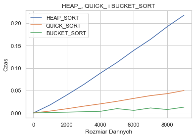

<p align="center">
	
	
  
</p>

# Computer Science Algorithms Implemented in Python

## Table of contents:
* [Welcome!](#welcome)
* [What Is Implemented So Far?](#what)
* [Tests & Plots](#tests)
* [Acknowledgments](#acknowledgments)

## Welcome! <a name="welcome"/></a>
Welcome to the Computer Science Algorithms Implemented in Python repository! This repository serves as a showcase of fundamental computer science algorithms implemented using Python. Each algorithm is organized into thematic folders for ease of navigation and reference.

## What Is Implemented So Far? <a name="what"></a>
 - **Bubble, Insertion, and Merge Sorts**: This section contains implementations of basic sorting algorithms such as Bubble Sort, Insertion Sort, and Merge Sort.
 - **Bucket, Counting, and Radix Sorts:** Here, you'll find implementations of non-comparison based sorting algorithms including Bucket Sort, Counting Sort, and Radix Sort.
 - **Heap and Quick Sorts:** Explore implementations of Heap Sort and Quick Sort, two efficient comparison-based sorting algorithms.
 - **Greedy and Dynamic Programming:** This section showcases algorithms based on the Greedy approach as well as solutions leveraging Dynamic Programming techniques.
 - **Graph Algorithms (BFS and DFS):** Dive into implementations of Breadth-First Search (BFS) and Depth-First Search (DFS) algorithms for graph traversal.

## Tests & Plots <a name='tests'></a>
In addition to Python code implementations, this repository also includes supplementary resources such as PDF documents and PNG images. These resources provide visual representations of algorithmic concepts and analyses, including plots depicting time complexity. 

<p align="center">
  
</p>

Feel free to uncomment whole code sections to experiment with the code yourself! 

```python
############ bucket_sort test ############
algorytmy = [HEAP_SORT, QUICK_SORT_test, BUCKET_SORT]
plt.xlabel('Rozmiar Dannych')
plt.ylabel('Czas')
plt.title( 'HEAP_, QUICK_ i BUCKET_SORT' )
    
for ALG in algorytmy:
    time_data = []
    
    label = str(ALG )[10:-23]        
    for size in tqdm( range( 1, SIZE_MAX+1, STEP ), label):
        avg_time = calculate_avg(size, ALG)
        time_data.append( avg_time )
    
    plt.plot( np.arange(0, SIZE_MAX, STEP) , time_data, label=label )
    plt.legend()
```


## Acknowledgments <a name='acknowledgments'></a>
Special thanks to the contributors and authors of the algorithms implemented in this repository.

